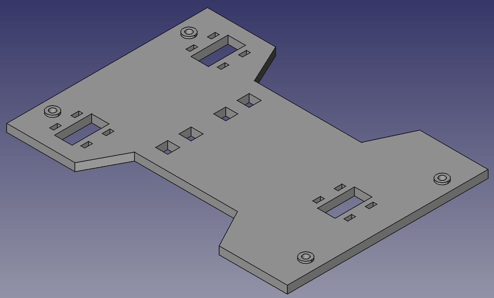
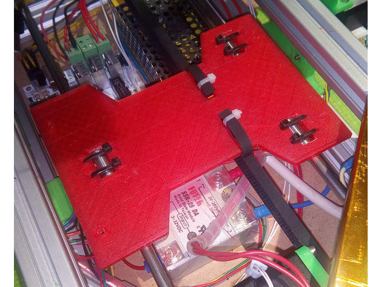
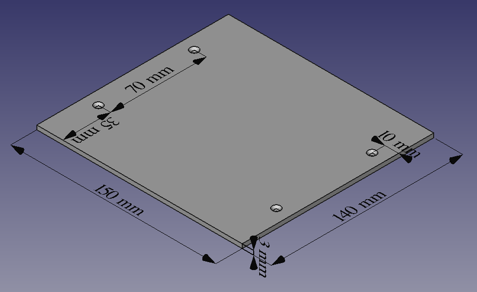

# Y-carriage with 4 points to hold the bed

## Files to download

  - [y-carriage-4points.stl](y-carriage-4points.stl) (STL printable)
  - [y-carriage-4points.fcstd](y-carriage-4points.fcstd) (FreeCAD source document)
  - [y-carriage-4points-laser.svg](y-carriage-4points-laser.svg) (Laser cut for methacrylate version)

## Bed measures

These are the measures of drills on the aluminium bed:

